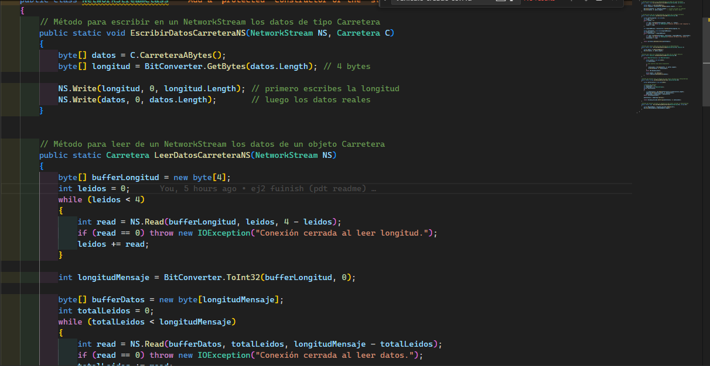
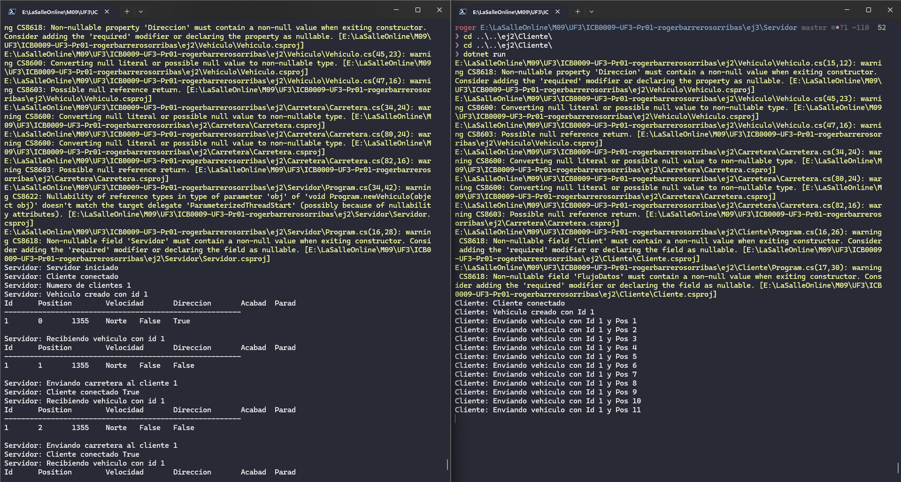
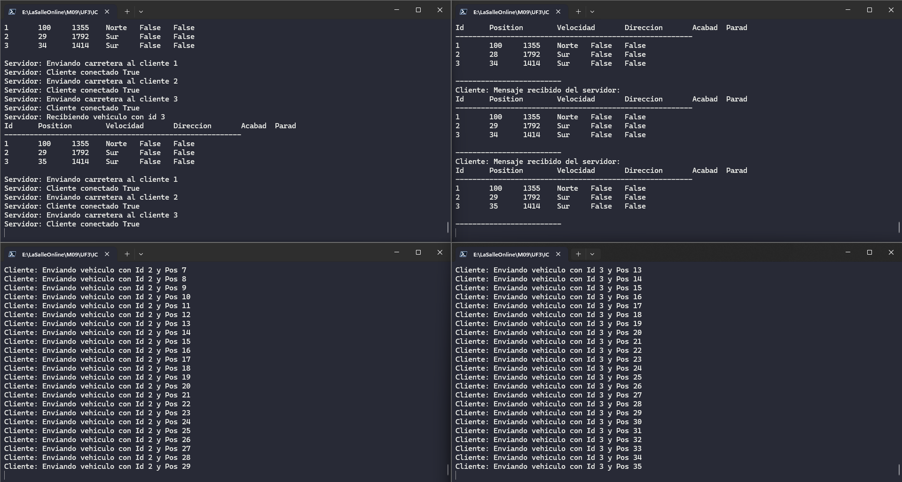

# Etapa 1:Programación de los métodos de la clase NetworkStreamClass

# Etapa 2: Crear y enviar los datos de un Vehiculo:

# Etapa 3: Mover los vehículos:

# Etapa 4: Enviar datos del servidor a todos los clientes:

# 